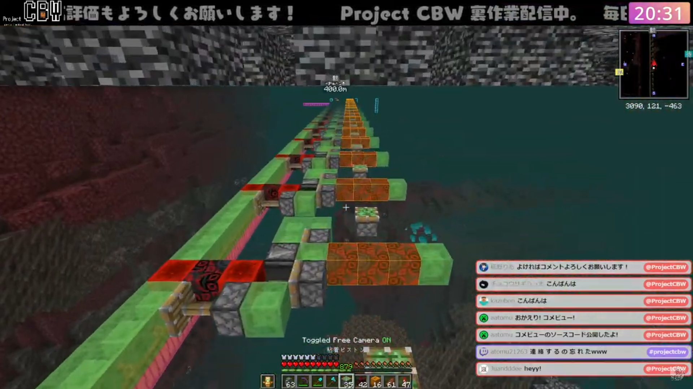
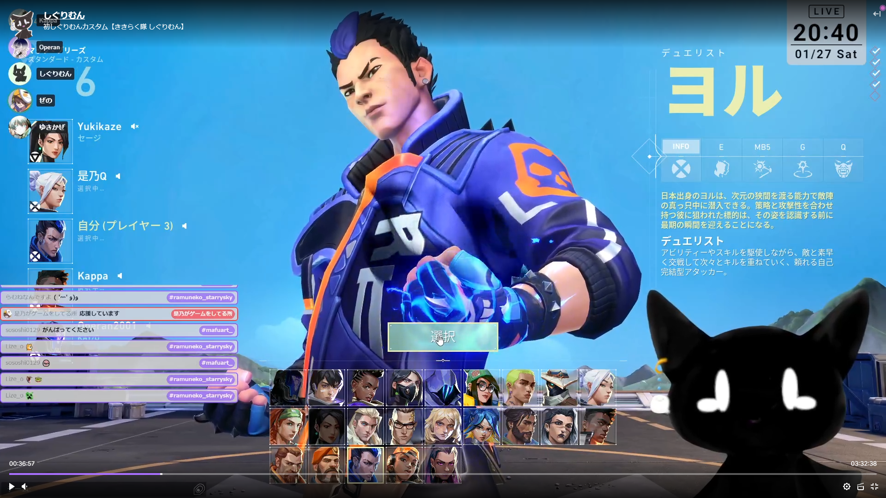

# Stream Tools Index

- Chat Subscriber(複数の配信チャットを表示): [こちら](#chat_subscriber)
- Discord Connector(Discord のいろいろ): [こちら](#discord_connector)

# chat_subscriber

## Description

Youtube や Twitch などの複数を同時に表示 Emoji/Emote や投げ銭にも対応

## How To Use

- User like : `Open URL` in Browser
- Streamer like : `Browser Source` in OBS (Recommended CSS is written below)

Example URL:

- `https://live.aatomu.work/?youtube=<Youtube Channel ID>`
- `https://live.aatomu.work/?twitch=<Twitch Channel ID>`
- `https://live.aatomu.work/?youtube=<Youtube Channel ID>&twitch=<Twitch Channel ID>&limit=10`
- `https://live.aatomu.work/?youtube=<Youtube Channel ID>&limit=10?cleanup=120`

### Supported Live Chat

|   Key    | Value Type |      Description      | Example               |
| :------: | :--------: | :-------------------: | :-------------------- |
| youtube  |   string   | Youtube Live Channel  | `youtube=@ProjectCBW` |
|  watch   |   string   |   Youtube Video ID    | `watch=xxxxxxx`       |
|  twitch  |   string   |  Twitch Live Channel  | `twitch=ProjectCBW`   |
| niconico |   string   | Niconico Live Channel | `niconico=xxxxx`      |
|  twicas  |   string   |  Twicas Live Channel  | `twicas=xxxxx`        |
| openrec  |   string   | OpenRec Live Channel  | `openrec=xxxxx`       |

### Supported Options

|   Key   |      Value Type      |                                     Description                                     | Example         | Default |
| :-----: | :------------------: | :---------------------------------------------------------------------------------: | :-------------- | :-----: |
|  limit  |        number        |                                    Display Limit                                    | `limit=10`      |   20    |
| cleanup |        number        |                                Cleanup Delay(Second)                                | `cleanup=10`    |         |
|   tip   | number,number,number |  Tip Message Read Config<br>`index,rate,volume`<br>\*Required enable button click   | `tip=0,1,1`     |         |
| message | number,number,number | Normal Message Read Config<br>`index,rate,volume`<br>\*Required enable button click | `message=0,1,1` |         |

OBS Custom CSS:

```css
body {
  background-color: rgba(0, 0, 0, 0);
  overflow: hidden;
}
```

## Supported Message,Event List

|   Site   |      Message       |    Emoji/Emote     |         Tip          |
| :------: | :----------------: | :----------------: | :------------------: |
| Youtube  | :white_check_mark: | :white_check_mark: |  :white_check_mark:  |
|  Twitch  | :white_check_mark: | :white_check_mark: | :small_red_triangle: |
| Niconico | :white_check_mark: |                    |         :x:          |
|  Twicas  | :white_check_mark: |                    |         :x:          |
| OpenREC  | :white_check_mark: |        :x:         |         :x:          |

## Contents HTML Tree

- Normal Chat

```html
<div class="contents">
  <div class="content {Site}">
    <span class="time">00:00:00</span>
    <div class="icon">
      
    </div>
    <span class="name">...</span>
    <div class="message-root">
      <span class="message">...</span>
      <span class="channel">...</span>
    </div>
  </div>
</div>
```

- Tip Chat

```html
<div class="contents">
  <div class="content {Site}">
    <span class="time">00:00:00</span>
    <div class="icon">
      
    </div>
    <span class="name">...</span>
    <div class="message-root">
      <span class="message">
        <span class="money" style="color: #000000;background-color: #000000;"
          >$0.00</span
        >
        ...
      </span>
      <span class="channel">...</span>
    </div>
  </div>
</div>
```

## Screen Shot

- Youtube * Twitch cross chat
  
- Twitch multi chat
  

## Credit

License: `Apache License`
※ できたら URL を張っていただけると幸いです

- Code
  - [aatomu(@aatomu)](https://x.com/aatomu21263): Front:HTML,JavaScript,CSS Background: Typescript
  - [らる(@rarula)](https://twitter.com/rarula_): Background: Typescript review
- Design
  - [椛野りあ(@KuoN_aLia)](https://x.com/KuoN_aLia): Default CSS
- Special Thanks
  - [ProjectCBW(@ProjectCBW)](https://x.com/ProjectCBW): Youtube/Twitch live test
  - Project CBW Listeners: Message view test, Design layout check
  - [しぐりむん(@shiglimnn)](https://twitter.com/shiglimnn): Multi Twitch live test

# discord_connector

## Description

- Discord の VC を移動しても自動で追いかけるように
- VC の名前を表示する,Discord ニトロの装飾を表示
- Advanced: Discord のプロフィールをカスタマイズする

## How To Use

### 初回設定

1. Discord-Connector を DL し起動する(この際 ネットワークの許可は許可する) [一覧](https://github.com/aatomu/chat_subscriber/tree/main/discord-connector/build)
2. <a href="https://discord.com/developers/applications" target="_blank">Discord Develop Applications</a>
3. `New Applications`をクリックして`Connector`に`Name`を設定し利用規約に同意し`Create`する
4. `https://live.aatomu.work/discord/?id=【ClientID】&secret=【ClientSecret】`をメモ帳などに張り付ける
5. サイドバー`Oauth2`を開く
6. `Client ID`を`Copy`を押し 先ほど貼り付けたものを書き換える
7. `Client Secret`のところの`Reset Secret`を押す(※この際 2FA が入る場合があります)<br>表示された`Copy`を押し 先ほど貼り付けたものを書き換える
8. `Redirects`の`Add Redirects`を押し `https://live.aatomu.work`を入力した後`Save Changes`する
9. 書き換え終わった URL を`OBSのブラウザソース`の URL に設定する
10. Discord に表示される認証で`認証`を押す
11. ※以下 プロフィールを書き換える人用<br>`Rich Presence`を開き`Add Image`で画像を追加,名前を設定し`Save Changes`する
12. 書き換え終わった URL を`ブラウザ`で開き ブラウザコンソールを出す
13. 下にあるコード(Set Activity)を実行する ※随所書き換え

### 二回目以降の起動方法

1. Discord-Connector の exe を実行する
2. OBS を起動する<br>Discord に認証画面が表示されるので、認証を押す

### 上記手順を自動化する方法

1. Discord-Connector の exe へのショートカットを作成する。
2. Ctrl+R を押し、出てきた画面に shell:startup と入力する
3. 開いた場所に、ショートカットを移動する。
   PC 起動時に自動的に exe が実行されるため、起動忘れがなくなります！

OBS Custom CSS:

```css
body {
  background-color: rgba(0, 0, 0, 0);
  overflow: hidden;
}
.channel {
  display: none;
}
```

Set Activity:

```javascript
Send("SET_ACTIVITY","",{
  "pid": 0,
  "activity": {
    "details":"【説明】",
    "state": "【詳細説明】",
    "timestamps": {
        "start": new Date().getTime() - (1000 * 60 * 60 * 23.999)
    },
    "assets": {
        "large_image":"【さっき設定した名前】",
        "large_text":"【画像の説明】",
    },
    "party": {
      "id":"-1",
      "size":[【現在の人数】,【上限の人数】]
    }
  }
})
```

## Contents HTML Tree

```html
  <div id="errors" class="error">
    ...
  </div>
	<div id="root" class="root">
		<div id="channel" class="channel">
      XXXXXX
		</div>
		<div id="users" class="users">
      <div id="0000000" class="user me">
        
        <span class="nick">....</span>
        <span class="name">....</span>
      </div>
      <div id="111111111" class="user">
        
        
        <span class="nick">....</span>
        <span class="name">....</span>
      </div>
		</div>
	</div>
```

## Credit

License: `Apache License`
※ できたら URL を張っていただけると幸いです

- Code
  - [aatomu(@aatomu)](https://x.com/aatomu21263): HTML,JavaScript,CSS Background: Golang
- Design
  - [椛野りあ(@KuoN_aLia)](https://x.com/KuoN_aLia): Default CSS
